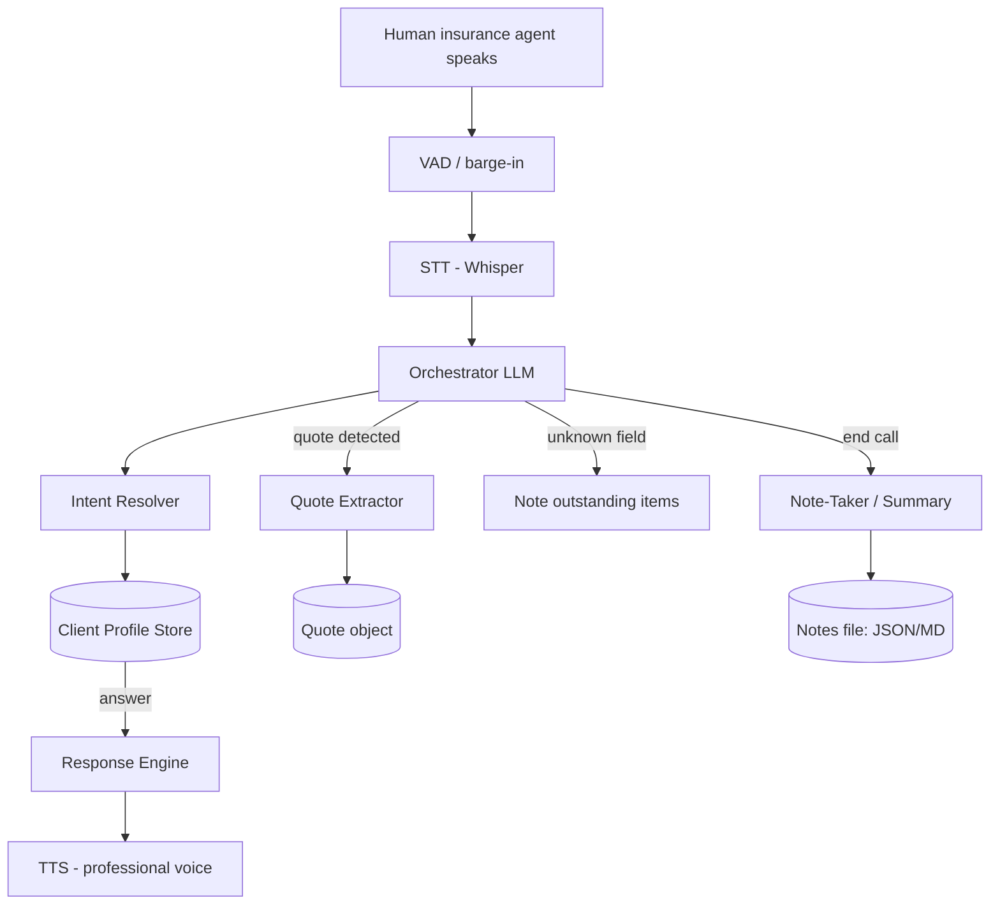

# Insurance Quote Agent — Architecture

**Purpose:** An AI voice agent that calls a live human insurance agent, answers the
agent's questions on behalf of a human client (in any order), honestly admits when
it lacks an answer, captures any quote it receives, and writes structured notes at
the end (quote obtained / details / why not).

This builds on the existing Voice AI chatbot (PyQt6 + Ollama LLM + faster-whisper STT
+ Kokoro TTS + RVC/cloning voice server + continuous voice chat).

## Two data directions (critical distinction)
1. **You → Agent:** your AI *answers* the agent's questions using a prepared
   **Client Profile** — the source of truth it must never invent.
2. **Agent → You:** your AI *captures* the **Quote** the agent gives (price,
   reference #, phone #, coverage, valid-until, ...).

There is **no scripted flow** — questions arrive in random order. Everything hangs
off a semantic question→field resolver, a stateful conversation memory, and a single
orchestrating LLM.

## Diagram


## Components

### 1. Client Profile Store — the facts your AI gives
Structured store of everything an agent might ask, grouped by domain, with
aliases/paraphrases so the resolver can match any phrasing.
- Groups: Identity, Contact, Address, Vehicle(s), License, Driving history,
  Current policy, Coverage preferences, Payment.
- Each field: canonical `key`, `label`, `value` (optional), `type`, `aliases`,
  `sensitive` flag.
- Single source of truth. If a field has no value, the honest answer is
  "I don't have that." — the AI never fabricates.

### 2. Intent Resolver — handles random question order
Maps the agent's spoken question to a canonical field, robust to rephrasing.
Hybrid approach:
- Embedding **semantic search** over field names + aliases → top-K candidates.
- LLM picks the exact field + decides if answerable.
- Output: `{field_key, confidence, matched}`.

### 3. Response Engine
- Matched + value → concise professional spoken answer.
- Matched + absent → honest "I don't have that information." + mark outstanding.
- No match → short clarifying question or polite pass.
- Speaks in a professional voice (e.g. George / Lily).

### 4. Quote Extractor — the info the agent gives you
Detects quote utterances; extracts structured data via LLM structured output (JSON):
`premium`, `payment_frequency`, `carrier`, `coverage_notes`, `reference_number`,
`phone_number`, `valid_until`. Appends/updates a single `quote` object.

### 5. Conversation Memory / State
Stateful object per call: questions asked/answered, **outstanding unknowns**, the
current quote object, and a soft `phase` (greeting → Q&A → quote capture → closing).
Phase is a hint, not a gate.

### 6. Orchestrator LLM — the brain
Single LLM with a caller persona + **tools**:
- `lookup_profile(field)` — deterministic access to the profile.
- `note_unknown(field)` — log things it couldn't answer.
- `log_quote(json)` — record quote details.
- `finalize_notes()` — trigger end-of-call summary.
Decides each turn: **answer / clarify / log quote / finalize**. Tools keep facts and
quote data deterministic (no hallucination in storage).

### 7. Note-Taker / Summary — end of call
On end signal, produce structured notes (JSON + readable Markdown) written to a file
and shown in the UI:
- **Quote obtained:** true/false.
- If true: carrier, price, payment frequency, **reference number, phone number**,
  valid-until, coverage notes.
- If false: **why not** (missing info, agent needs X) + **what's needed** to get a
  quote (outstanding fields).
- Plus a raw transcript + audit trail.

## Data flow (per turn)
```
agent speech → VAD → STT (text)
  → Orchestrator: "profile question / quote / end-of-call?"
      profile question  → Intent Resolver → Response Engine → TTS
      quote given       → Quote Extractor → update quote → confirm briefly
      unknown field     → honest reply + note outstanding → TTS
      end of call       → Note-Taker → write notes
  → loop
```

## Key design decisions / best practices
- Profile is the source of truth; answer only from it; say "I don't have that"
  otherwise.
- Separate extractors: read (answer) vs write (quote capture) — different risks.
- Structured JSON outputs for quote + notes → reliable, parseable data.
- Stateful, not scripted — resolver + orchestrator handle shuffled questions.
- Honesty enforced at the system level (absent field ⇒ "don't know").
- Privacy: profile holds sensitive data (DOB, address, VIN, license); keep local.
- Test harness: a simulated "human" asks questions in random order + injects a quote.

## Build order
1. **Client Profile schema** + sample filled profile.  *(current step)*
2. Intent Resolver (embeddings + LLM disambiguation); test paraphrases.
3. Response Engine + honesty rules into the existing voice loop (continuous chat +
   professional voice).
4. Quote Extractor (structured output) + quote object.
5. Conversation memory + outstanding-unknown tracking.
6. Note-Taker final summary + file output.
7. Test harness with randomized question order.
